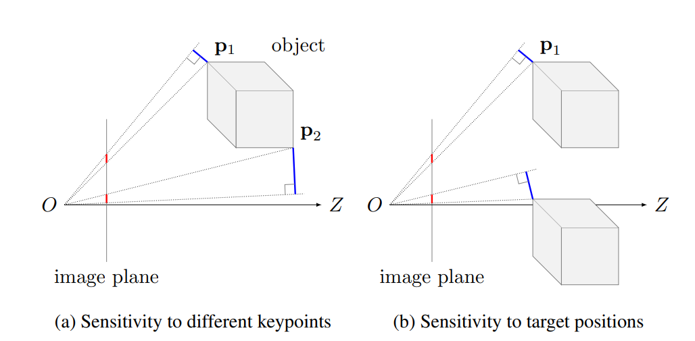

# Overview

This repository contains the dataset and code in paper [**Wide-Depth-Range 6D Object Pose Estimation in Space**](https://arxiv.org/abs/2104.00337). Yinlin Hu, Sébastien Speierer, Wenzel Jakob, Pascal Fua and Mathieu Salzmann. CVPR 2021.

6D pose estimation in space poses unique challenges that are not commonly encountered in the terrestrial setting. One of the most striking differences is the lack of atmospheric scattering, allowing objects to be visible from a great distance while complicating illumination conditions. Minimizing the 2D reprojection error is a common strategy for 6D pose estimation. This strategy, however, suffers when handling wide-depth-range targets. 

<p align="center">
  
  <br>
  <em>Problem with minimizing the 2D reprojection error. (a) The red lines denote the 2D reprojection errors for points p1 and p2. Because one is closer to the camera than the other, these 2D errors are of about the same magnitude even though the corresponding 3D errors, shown in blue, are very different. (b) For the same object at different locations, the same 2D error can generate different 3D errors. This makes pose accuracy dependent on the relative position of the target to the camera. We propose to minimize the loss in 3D space, which can effectively remove the position-related bias.</em>
</p>

On the other hand, currently available benchmark datasets do not place a sufficient emphasis on space scenario and mostly depict the target in close proximity. To overcome this problem, we also introduce SwissCube dataset, the first space-borne dataset with an accurate 3D model, physically-based rendering, and physical simulations of the Sun, the Earth, and the stars.

<p align="center">
  
  <br>
  <em>The rendering breadown of SwissCube</em>
</p>

# How to Use

Download the SwissCube dataset from [**here**](https://u.pcloud.link/publink/show?code=XZ7ExHVZNw3kUckPM8SOWzepcE6ANF9jpPYX), and create proper links according to the config file "./configs/swisscube.yaml". Most of the code is self-explaining and a pretrained model is available at [**here**](https://u.pcloud.link/publink/show?code=XZXExHVZdhF4jg8ou80vT0rEnh8EA8UzwH8y). Just start from "train.sh" (or "test.sh") and have fun.

# Citing

```
@inproceedings{hu2021wdrpose,
  title={Wide-Depth-Range 6D Object Pose Estimation in Space},
  author={Yinlin Hu and S\'ebastien Speierer and Wenzel Jakob and Pascal Fua and Mathieu Salzmann},
  booktitle={CVPR},
  year={2021}
}
@inproceedings{hu2020singlestagepose,
  title={Single-Stage 6D Object Pose Estimation},
  author={Yinlin Hu and Pascal Fua and Wei Wang and Mathieu Salzmann},
  booktitle={CVPR},
  year={2020}
}
@inproceedings{hu2019segpose,
  title={Segmentation-driven 6D Object Pose Estimation},
  author={Yinlin Hu and Joachim Hugonot and Pascal Fua and Mathieu Salzmann},
  booktitle={CVPR},
  year={2019}
}
```

# Notes

* The model in this repo has much higher accuracy than the paper version after tweaking hyper-parameters. The claims of the paper, nevertheless, still hold.
* Some code snippets are adapted from: https://github.com/facebookresearch/maskrcnn-benchmark


